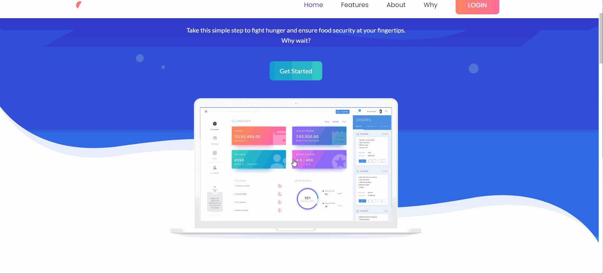

# Foodtank

Foodtank is a sevice platform which is created for connecting the food donours and the food accepters

### Application demo

[**click here**](http://node-zero-waste.herokuapp.com/) to see the demo of our project

## overview

Our platform uses technology to streamline the process of food recovery and distribution, giving businesses and organizations the power to fight hunger and food waste within minutes. The application helps to minimize food wastage by effectively rescuing the excess food from weddings, parties, restaurants and temples and redeploying food resources in an efficient manner.

In this way, we wish to bridge the gap between these issues by connecting people and ensuring that the untouched left over food, can be distributed to people in need of food through reliable local NGO partners.

## Work flow
 - Food Users who have excess food post their details such as - location, time when the food was made, number of people, cuisine type and additional data.

 - Transport Food Anyone who can transport food, can contribute by delivering food from one location to another.

 - Request Food NGOs or people who manage orphanages/shelter homes can request for food based on their requirements.

##  Tech stack

     - Nodejs
     - express.js
     - MongoBD
     - HTML5, CSS, Bootstrap
     - Handlebars
     
##  Deployment Instructions on Local
 - Prerequisite Softwares: Nodejs, VScode/any IDE, npm module.
 
 - Clone the repo from Github.
 
 - Change the directory to the cloned folder
 
   `cd <name-of-the-folder>`
   
 - Run the npm command to intall the dependencies.
 
   `npm install`
   
- Run the npm command to run the application.
  
  `npm run devStart`

 - You can now access the application at http://localhost:3000/

## CONTRIBUTORS
  [Abdul Adhil PK](https://adhilcodes.me)    
  
  [Muhammed Hashir PM](https://hashirpm.github.io/)

Kindly reach out to us if you wish to suggest improvements or provide any other feedback.
